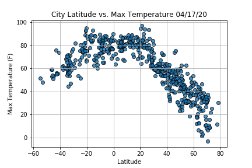
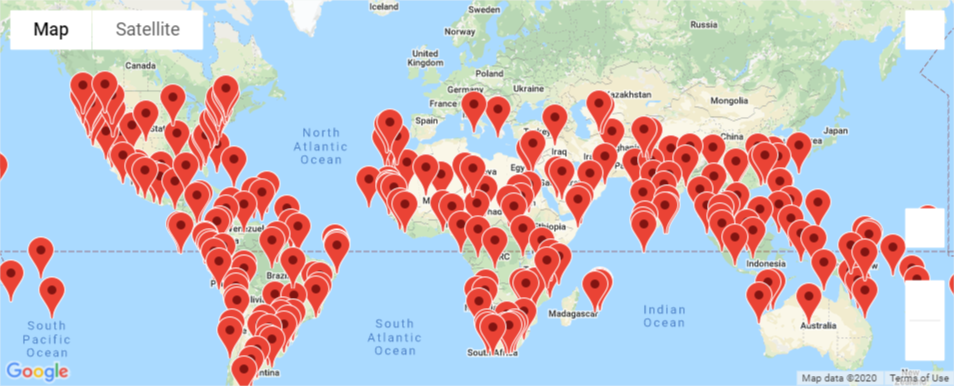

# World_Weather_Analysis
This repo uses pandas and API's to collect and transform weather and hotel data for a potential trip. Users must enter their preference on weather for a vacation and can choose from the database or interactive map.
---
The WeatherPy file contains analysis regarding latitude and weather correlation for north and south hemispheres (see example below).
#  
# Vacation
The Vacation_Search code generates a random list of coordinates and finds cities closest to those coordinates using Citipy module (imported). It then uses a weather API to find the weather in this city, construct a database from this information, and find hotels in this city using a Google API. It is a functional app for a user to generate/ sift through data and plan a perfect trip.

